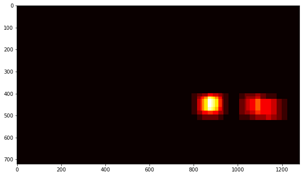

# Vehicle Detection Project Report

***

## Goal and Objective
---

The goals / steps of this project are the following:

* Perform a Histogram of Oriented Gradients (HOG) feature extraction on a labeled training set of images and train a classifier Linear SVM classifier.
* Optionally, you apply color transform and append binned color features, to HOG feature vector. 
* Train a classifier to disinguish between car and non-car images
* Implement a sliding-window technique and use your trained classifier to search for vehicles in images.
* Run vehicle detection pipeline on a video stream and create a heat map of recurring detections frame by frame to reject outliers and follow detected vehicles.
* Estimate a bounding box for vehicles detected.

## Model Training
---
_The jupyter notebook containing code for model training can be [found here](./Vehicle-Detection.ipynb) (cells 7-9)._


### 1.  HOG features

The code for HOG feature extraction can be found in the above jupyter notebook in function `get_hog_features` of cell 5.  

I started by reading in all the `vehicle` and `non-vehicle` images.  Here is an example of one of each of the `vehicle` and `non-vehicle` classes:


I then explored different color spaces and different `skimage.hog()` parameters (`orientations`, `pixels_per_cell`, and `cells_per_block`).  I grabbed random images from each of the two classes and displayed them to get a feel for what the `skimage.hog()` output looks like.

Here is an example using the `YCrCb` color space and HOG parameters of `orientations=8`, `pixels_per_cell=(8, 8)` and `cells_per_block=(2, 2)`:


### 2. Feature Extraction for Model

After trying several combination of parameters, the final parameter values I landed on is as follows:

```
color_space = 'YCrCb'
spatial_size = (32, 32)
hist_bins = 32
orient = 9
pix_per_cell = 8
cell_per_block = 2
hog_channel = 'ALL'
spatial_feat = True
hist_feat = True
hog_feat = True
```

The increase in orientation increased the accuracy of classifier which was also accompanied by increase in classification time.
 
I decided `YCrCb` for color space because it performed much better than `RGB`, `HLS` and `HSV`.

### 3. Data Augmentation and Train-Test Split 

I randomly flipped some images and added it to the data directory. I also used `train_test_split` from `sklearn.model_selection` to make a training and testing datase.

### 4. Model Training

For training the model hog features along with spatial and histogram features were used. These features were fed to LinearSVC model with l2 normalization. The accuracy of the model on test data was 99.32%. The code can be found in the jupyter notebook at cells 9 and 10.

## Pipeline
---

### 1. Sliding Window Search
I reused the `find_cars` method from course materials. This method can be found in cell 5 of the above notebook. This method combines HOG feature extraction with a sliding window search. The HOG features are extracted for the entire image only once and the features for each small window is sampled from HOG feature of the whole image. The method performs the classifier prediction on the HOG features, histogram feature and spatial feature for each window region and returns a list of rectangle where the cars were detected.

This is an example of such image.:


In the final code for pipeline (cell 24), I used multiple sliding window search using different scales and x, y positions. The values for these parameters were found emperically by running find_cars method multiple times. This approach also prevents calculation of feature vectors for the complete image and thus helps in speeding up the process.

The figure below shows the windows from multiple scales drawn on a test image.


This is what the result from final implementation looks like:


After this,  add_heat function is applied. This function increments the pixel value (referred to as "heat") of an all-black image the size of the original image at the location of each detection rectangle. Areas encompassed by more overlapping rectangles are assigned higher levels of heat. The following image is the resulting heatmap from the detections in the image above:



A threshold function is applied to remove false positives.

## Video Implementation
---

### 1. Vehicle Detection
The youtube video of the final implementation can be accessed by clicking the following image link.

[https://www.youtube.com/watch?v=gnnHQkbS_0c]


### 2. Filter for false positives and combining overlapping boundaries
First, rectangles with vechicles detected in them were generated using different scales and x, y positions.. From these rectangles, a heatmap is created and then this heat map is passed through threshold filter. This helps mitigate the issue of false positive.. I then used scipy.ndimage.measurements.label() to identify individual blobs in the heatmap. These blobs correspond to vehicles and hence bounding boxes were drawn for these blobs.


## Discussion
---

- The detected rectangles can be made smoother by using previous frames.
- Sometimes the classifier seems to have difficulty finding the back of the car. 
- The algorithm has not been tested for driving under different lighting conditions.
